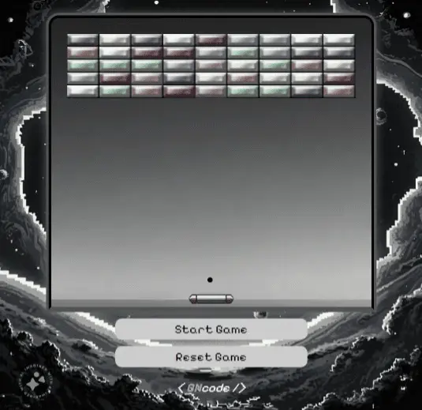

# Arkanoid Game in JavaScript

This is a simple Arkanoid game created using HTML5 Canvas and JavaScript. The goal is to move the paddle to bounce a ball and destroy the bricks at the top. Have fun!

## Instructions

1. Clone this repository.
2. Open the `index.html` file in your browser.
3. Use the left and right arrow keys to move the paddle.
4. Destroy all the bricks to win!

## Technologies Used

- HTML5 Canvas
- JavaScript

## Screenshot

## Credits

This game was inspired by the classic Arkanoid by Taito.

## Contributions

If you'd like to contribute, feel free to do so! Open a pull request or create an issue.

Enjoy playing! 🎮

